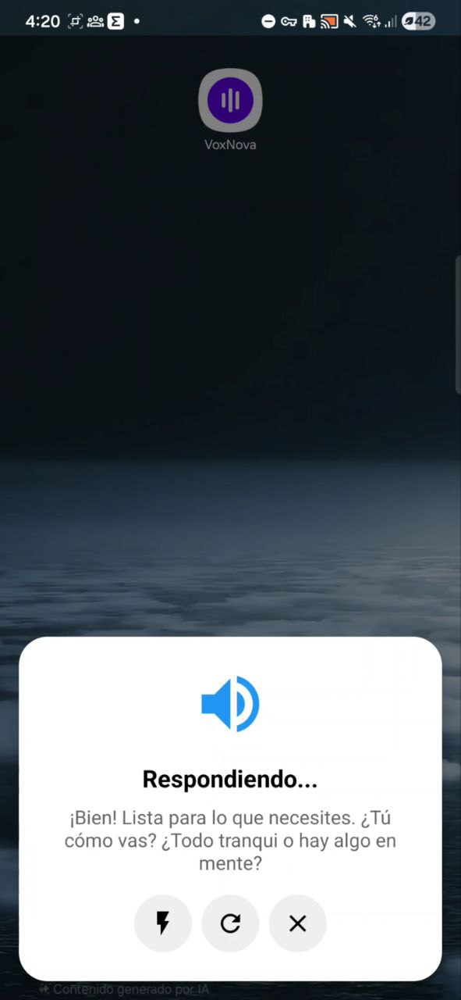
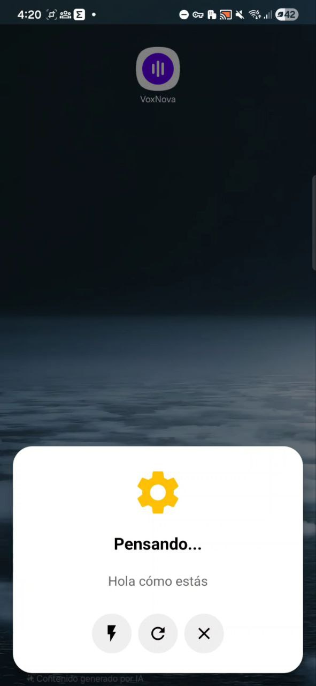

# VoxNova

A native Android voice assistant app that integrates with [OpenClaw](https://github.com/openclaw/openclaw) AI gateway. VoxNova provides hands-free voice interaction with AI through speech recognition and text-to-speech synthesis.

## Screenshots

<p align="center">
  
  
</p>

## Features

- **Voice Interaction**: Natural voice input using Android's built-in speech recognition
- **AI Integration**: Real-time communication with OpenClaw gateway via WebSocket
- **Multi-provider TTS**: Choose between Cartesia AI, ElevenLabs, Google TTS, or automatic fallback
- **Device Identity**: Ed25519 cryptographic identity for secure OpenClaw protocol v3 authentication
- **Quick Commands**: Predefined command buttons for common actions
- **System Integration**: Registers as Android's default digital assistant
- **Configurable Language**: Support for multiple languages (Spanish, English, Portuguese, French, German, Italian)
- **Adjustable Silence Timeout**: Configurable delay before voice input is sent (1-10 seconds)

## Requirements

- Android 8.0 (API 26) or higher
- Java 17
- Android SDK 34
- OpenClaw gateway instance

## Building

### Using Gradle

```bash
# Build debug APK
./gradlew assembleDebug

# Build release APK
./gradlew assembleRelease

# Clean and rebuild
./gradlew clean assembleDebug

# Install to connected device
./gradlew installDebug
```

### Using Build Script

```bash
# Sets up environment automatically
./build.sh
```

Output APK: `app/build/outputs/apk/debug/app-debug.apk`

## Installation

1. Build the APK using the commands above
2. Install on your Android device
3. Open VoxNova app to configure settings
4. Set VoxNova as your default assistant:
   - Go to **Settings** → **Apps** → **Default apps**
   - Select **Digital assistant app**
   - Choose **VoxNova**
   - Grant permissions when prompted

## Configuration

Configure the following settings in the app:

| Setting | Description |
|---------|-------------|
| Gateway URL | OpenClaw WebSocket URL (e.g., `ws://192.168.1.100:18789`) |
| Auth Token | OpenClaw authentication token |
| Cartesia API Key | Optional API key for Cartesia TTS |
| ElevenLabs API Key | Optional API key for ElevenLabs TTS |
| TTS Provider | Select TTS engine: Auto, Cartesia, ElevenLabs, or Google |
| Language | Speech recognition and TTS language (default: `es-MX`) |
| Silence Timeout | Time to wait after speech before sending (1-10 seconds) |

## Architecture

### Core Flow

```
Voice Input → VoxNovaVoiceInteractionSession (Android STT)
    → ClawdbotClient (WebSocket) → OpenClaw Gateway
    → Response aggregation → TTSManager → Audio Output
```

### Components

| Component | Description |
|-----------|-------------|
| `ClawdbotClient` | WebSocket client for OpenClaw gateway (protocol v3) |
| `VoxNovaVoiceInteractionSession` | Main voice interaction logic with STT and UI |
| `TTSManager` | Multi-provider TTS with selectable engine or automatic fallback |
| `DeviceIdentity` | Ed25519 key management for OpenClaw protocol v3 authentication |
| `SettingsActivity` | Configuration UI |
| `PreferencesManager` | SharedPreferences wrapper |
| `DebugLogger` | In-memory logging for debugging |
| `QuickCommand` | Predefined command buttons |

### TTS Providers

You can select a specific TTS provider in settings, or use Auto mode for automatic fallback:

| Provider | Voice | Model | Notes |
|----------|-------|-------|-------|
| Cartesia AI | Daniela MX | `sonic-2` | Requires API key |
| ElevenLabs | Lily | `eleven_multilingual_v2` | Requires API key |
| Google TTS | System default | - | Always available |

**Auto mode fallback order**: Cartesia → ElevenLabs → Google TTS (uses first available with API key)

### Supported Languages

| Code | Language |
|------|----------|
| `es-MX` | Spanish (Mexico) |
| `es-ES` | Spanish (Spain) |
| `en-US` | English (US) |
| `en-GB` | English (UK) |
| `pt-BR` | Portuguese (Brazil) |
| `fr-FR` | French |
| `de-DE` | German |
| `it-IT` | Italian |

### WebSocket Protocol

- Protocol version: 3
- Message types: `req`, `res`, `event`
- Streaming via `agent` events with `lifecycle.phase` tracking
- Idempotency keys for message deduplication

## Permissions

| Permission | Purpose |
|------------|---------|
| `INTERNET` | Network communication with gateway |
| `RECORD_AUDIO` | Voice input capture |
| `FOREGROUND_SERVICE` | Continuous voice interaction |
| `FOREGROUND_SERVICE_MICROPHONE` | Microphone access in foreground |

## Development Notes

- Cleartext HTTP traffic is enabled for local development
- View Binding is enabled in the build configuration

## License

MIT License - See [LICENSE](LICENSE) file for details
